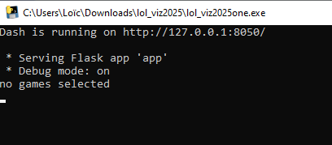
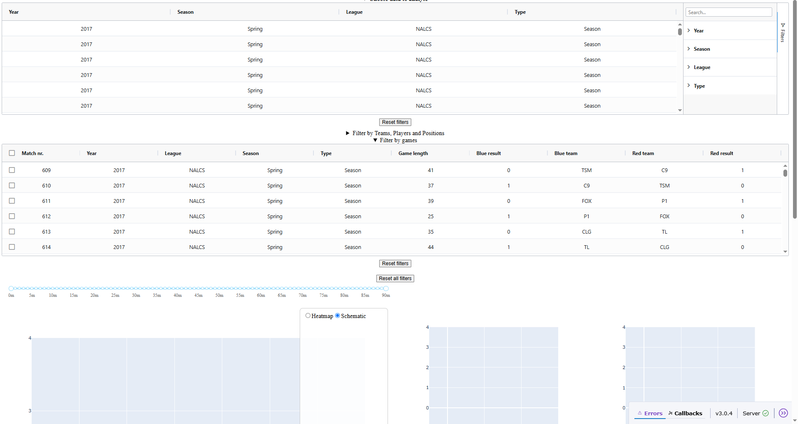
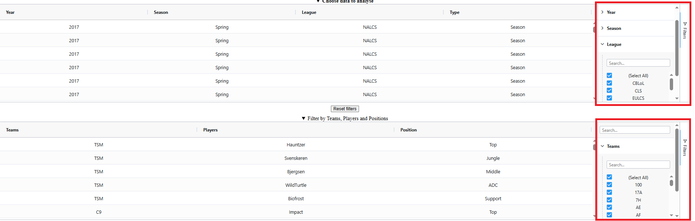
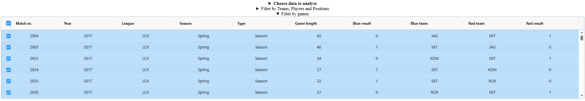

# Introduction
Hi thank you for volunteering to test our League of Legends competitive data visualization.
You were given this package containing the following:
- This user manual, which will explain everything you need to know to run this (and related images)
- `lol_viz2025.exe`the executable to run run the app.

## Your role
Try the application in relation to your user case. The user cases for our application are:
- Casual player trying to get better at the game
- Competitive/Semi-pro player
- Coach/Analyst/Manager

Consider the application as a tool to give you additional insights on the games presented. Consider the tool aspect of it and not the data itself as it only serves as an example. After trying it out we ask you to fill out a google forms to evaluate the tool. Please fill the evaluation out with a **critical and honest mindset** that would allow us to have a relevant evaluation. You can find the form [here](https://docs.google.com/forms/d/e/1FAIpQLSfIrSlJi3F6rYJmHPT0nV5Pi0tKlDmRJdY3k1cLOK03QOkvpg/viewform?usp=header).

Note that we can only consider evaluations given before Sunday noon!
## Considerations
We are in no way affiliated with Riot Games or in any way endorsed by them. This is a university project done in the context of a Information Visualization course. The dataset we used is publicly available on [kaggle](https://www.kaggle.com/datasets/chuckephron/leagueoflegends/data).

Some of the game assets available on the community backed cdn were used (and slightly modified) in the making of some visualizations.

The minimap image used is from [this post](https://www.reddit.com/r/leagueoflegends/comments/pl92ho/vector_map_of_summoners_rift_wip/).

If you want to take a more in-depth look at the code behind it checkout our [github repository](https://github.com/lcordeir/info-viz-league).

# Using the application
## Startup
The .exe will open up a command prompt. I know it looks suspicious but do not worry. It takes sometime to read the dataset and setup a local webserver.
A test will then appear confirming the app is launched and indicating an address plus port to put into your browser

You should copy paste that link (http://127.0.0.1:8050/) in your browser of choice, we recommend Google Chrome.
## Base interface
### Filtering
You will first be faced with this page of empty plots and filtering options.

The filters offer coarse and fine granularity of hierarchical filtering. The following parts are toggleable:
- Choose data to analyse
- Filter by Teams, Players and Positions
- Filter by games

The final layer "Filter by games" is what is going to define the games selected for the visualizations. the previous filters will apply higher level filters filtering the games shown in the final layer.

The left part will show you the available data for that layer of filters, it's on the right part (highlighted in red) that you can select the filters to apply, respectively deselect data you are not interested in. You can make the right or left side bigger.

After filtering the options you can select all the resulting games or individual ones. In the example hereunder we selected all the games from SKT.

From there on out you can enjoy the visualizations that we provide. You have a minimap of the Summoners' Rift on the left side with timelines of the games. You can focus on a limited timeframe by using the slider above the map.

Note that when when selecting multiple games, the visualizations shown aggregate data together to give you an overall feel. However if you select a single game the data shown refers to that one game.

*NB: Some visualizations are not well suited for single games data*

If you have any questions feel free to contact me (if this was forwarded to you by someone they can refer you back to me).
Thank you for participating and have a nice weekend!